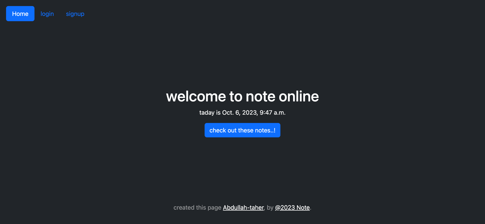
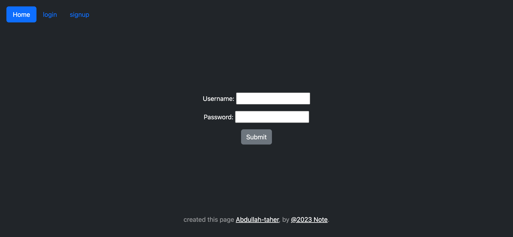
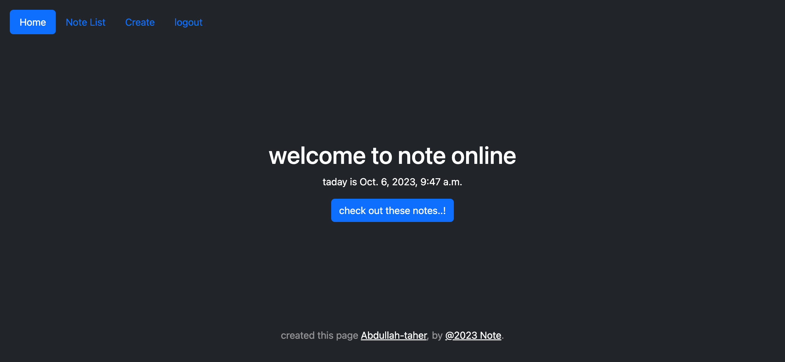
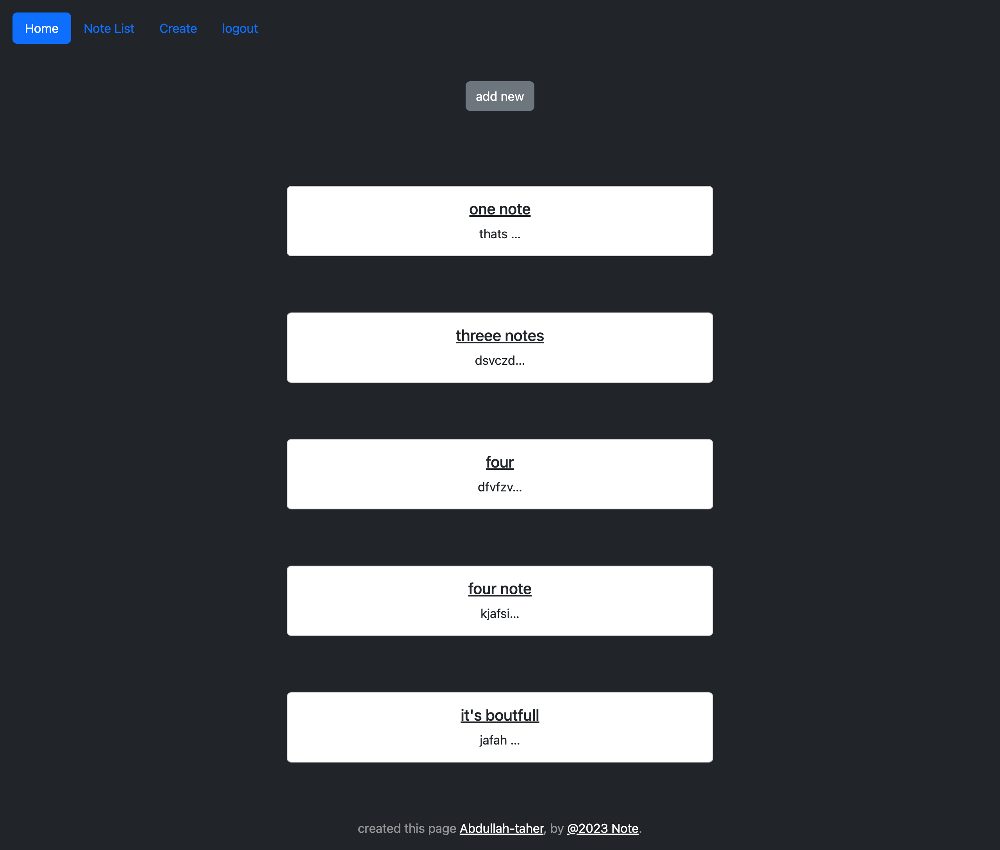
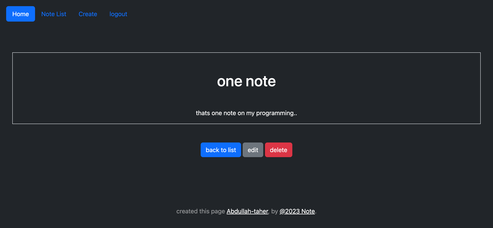
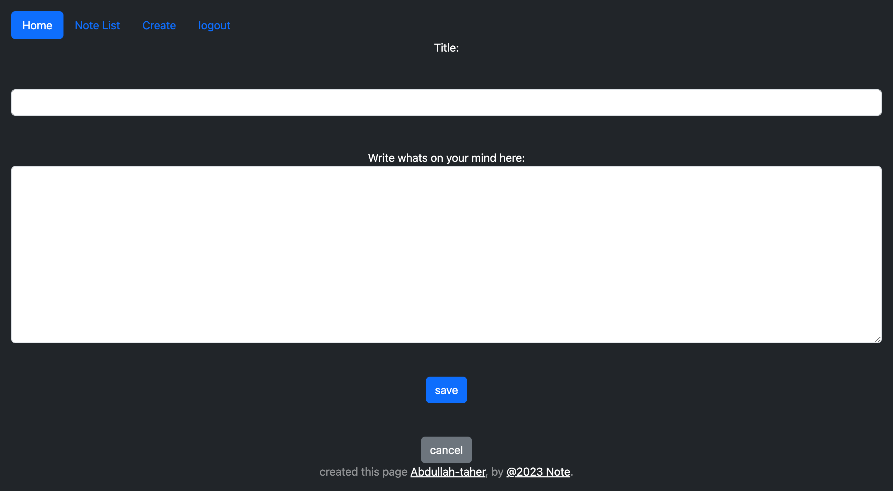
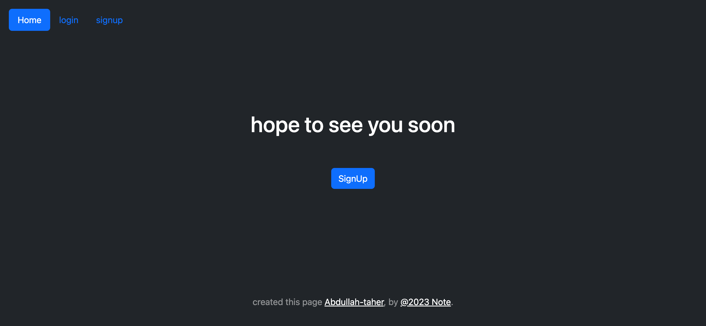
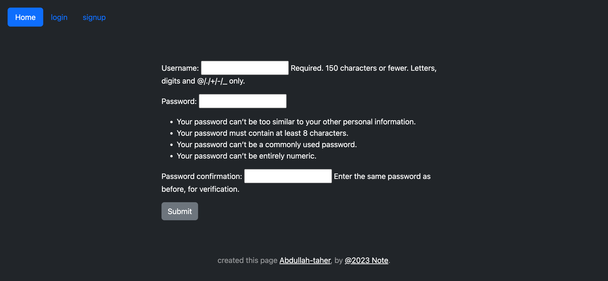

# My Note Web

This is a web application created using the Django framework for taking notes.

## Project Details

- This project was created using the Django framework.
- It consists of two Django applications.
- It includes models, class-based views, login and logout functionality, forms, CRUD operations, and user authentication.

## Getting Started

To run this project locally, follow these steps:

1. Clone this repository to your local machine:

2. Navigate to the project directory:

3. Create a virtual environment and activate it:
   

4. Install the project dependencies:

5. Apply the database migrations:

6. Start the development server:

7. Open your web browser and visit http://localhost:8000/ to access the application.

## Features

- Create, update, and delete notes.
- User authentication for secure access.
- User-friendly interface.

## Contributing

If you want to contribute to this project, feel free to submit issues or pull requests.

<h2>Screenshot of the projects 📸</h2>

<h1>Home Page : 🏡</h1>

<h1>Login : 🏡</h1>

<h1>Loged: 🏡</h1>

<h1>Note List : 🏡</h1>

<h1>Note Detail : 🏡</h1>

<h1>Create Note : 🏡</h1>

<h1>Logout : 🏡</h1>

<h1>Signup : 🏡</h1>

